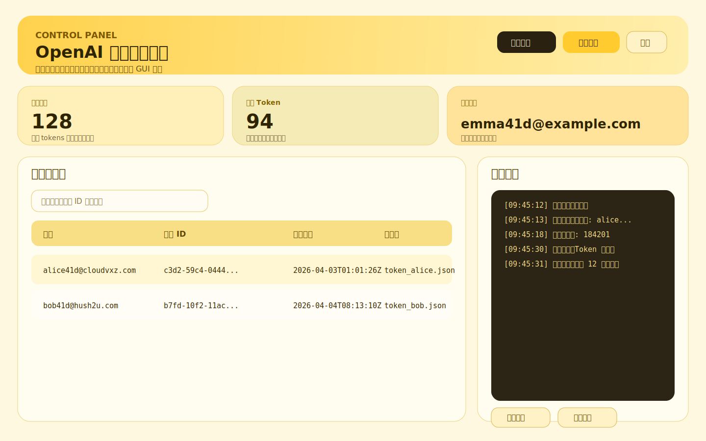

<p align="center">
  <h1>OpenAI Reg GUI</h1>
  <p>轻量的图形界面版本，下载后直接运行。</p>
  
</p>

## 界面预览



## 直接使用

按你的系统下载对应文件，然后直接运行。

### Windows

可用文件：

- `release/windows/codex-man.exe`

使用步骤：

1. 下载文件
2. 如果是压缩包，先解压
3. 双击 `codex-man.exe`
4. 在界面里填写代理、并发、轮数、延时等参数
5. 点击“开始注册”

### Linux

可用文件：

- `release/linux/codex-man`
- `release/linux/codex-man-linux.tar.gz`

使用步骤：

1. 下载文件
2. 如果是压缩包，先解压
3. 给程序执行权限
4. 运行程序

示例命令：

```bash
chmod +x ./codex-man
./codex-man
```

## 使用后会产生什么

- 注册结果会写入程序目录下的 `tokens/`
- 主界面可以直接查看账号列表
- 日志会在 GUI 内实时显示
- 支持导出 CSV / JSON

## 配置项说明

- 代理地址：注册时使用的代理
- 每轮并发：每轮同时运行的任务数
- 批量轮数：填 `0` 表示无限循环
- 最短延时 / 最长延时：每轮之间的等待区间
- 单账号模式：只注册 1 个账号
- 禁用 `Sub2Api`：关闭推送逻辑

## 建议上传内容

如果只是发成品包，Git 或发布页保留这些就够了：

- `README.md`
- `docs/`
- 图片文件
- `release/` 里的打包结果

源码、缓存、构建中间文件都不需要上传。